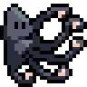

<!-- PROJECT SHIELDS -->
<!--
*** I'm using markdown "reference style" links for readability.
*** Reference links are enclosed in brackets [ ] instead of parentheses ( ).
*** See the bottom of this document for the declaration of the reference variables
*** for contributors-url, forks-url, etc. This is an optional, concise syntax you may use.
*** https://www.markdownguide.org/basic-syntax/#reference-style-links
-->
[![Contributors][contributors-shield]][contributors-url]
[![Forks][forks-shield]][forks-url]
[![Stargazers][stars-shield]][stars-url]
[![Issues][issues-shield]][issues-url]
[![MIT License][license-shield]][license-url]
[![LinkedIn][linkedin-shield]][linkedin-url]


<!-- PROJECT LOGO -->
<br />
<p align="center">
  <a href="https://github.com/dustinewan/rust-general_pub_sub">
    
  </a>

  <h3 align="center">General Pub Sub</h3>

  <p align="center">
    A fast, flexible, general use Pub Sub for Rust.
    <br />
    <a href="https://docs.rs/general_pub_sub"><strong>Explore the docs »</strong></a>
    <br />
    <br />
    <a href="https://github.com/dustinewan/rust-general_pub_sub/issues">Report Bug</a>
    ·
    <a href="https://github.com/dustinewan/rust-general_pub_sub/issues">Request Feature</a>
  </p>
</p>


<!-- TABLE OF CONTENTS -->
<details open="open">
  <summary>Table of Contents</summary>
  <ol>
    <li>
      <a href="#about-the-project">About The Project</a>
    </li>
    <li>
      <a href="#getting-started">Getting Started</a>
      <ul>
        <li><a href="#installation">Installation</a></li>
      </ul>
    </li>
    <li><a href="#usage">Usage</a></li>
    <li><a href="#roadmap">Roadmap</a></li>
    <li><a href="#contributing">Contributing</a></li>
    <li><a href="#license">License</a></li>
    <li><a href="#contact">Contact</a></li>
    <li><a href="#acknowledgements">Acknowledgements</a></li>
  </ol>
</details>


<!-- ABOUT THE PROJECT -->
## About The Project

PubSub is an increasingly commonly used pattern for scaling out applications.  However, there isn't a canonical library for implementing PubSub in Rust.

All of the pros / cons of PubSub are beyond the scope of this readme, but the basic gist can be found on the [Publish-Subscribe Pattern Wikipedia Page](https://en.wikipedia.org/wiki/Publish%E2%80%93subscribe_pattern).

My goal with this library is to provide an implementation that is, above all, fast, and is also flexible and **easy to use**.


<!-- GETTING STARTED -->
## Getting Started

### Installation

Add the following to your cargo.toml

```toml
[dependencies]
general_pub_sub = "<version>"
```

Alternatively, you could use `cargo-edit`.

```sh
cargo install cargo-edit
cargo add general_pub_sub
```

Please refer to the [crates.io documentation on dependencies for more details](https://doc.rust-lang.org/cargo/guide/dependencies.html).


<!-- USAGE EXAMPLES -->
## Usage

Examples of how to utilize PubSub, please refer to the [examples in the source code](https://github.com/DustinEwan/rust-general_pub_sub/tree/main/examples).

All examples can be executed by cloning the repo and running

```sh
cargo run --example <name>
```

for example, to run the `networking.rs` example:

```sh
cargo run --example networking
```

_For more examples and documentation of the API, please refer to the [Documentation](https://docs.rs/general_pub_sub)_


<!-- ROADMAP -->
## Roadmap

See the [open issues](https://github.com/dustinewan/rust-general_pub_sub/issues) for a list of proposed features (and known issues).


<!-- CONTRIBUTING -->
## Contributing

Contributions are what make the open source community such an amazing place to be learn, inspire, and create. Any contributions you make are **greatly appreciated**.

1. Fork the Project
2. Create your Feature Branch (`git checkout -b feature/AmazingFeature`)
3. Commit your Changes (`git commit -m 'Add some AmazingFeature'`)
4. Push to the Branch (`git push origin feature/AmazingFeature`)
5. Open a Pull Request


<!-- LICENSE -->
## License

Distributed under the GNU GPL v3 License. See `LICENSE` for more information.


<!-- CONTACT -->
## Contact

Dustin Ewan - dustineewan@gmail.com

Project Link: [https://github.com/dustinewan/rust-general_pub_sub](https://github.com/dustinewan/rust-general_pub_sub)


<!-- ACKNOWLEDGEMENTS -->
## Acknowledgements
* [GitHub Emoji Cheat Sheet](https://www.webpagefx.com/tools/emoji-cheat-sheet)
* [Img Shields](https://shields.io)
* [Choose an Open Source License](https://choosealicense.com)


<!-- MARKDOWN LINKS & IMAGES -->
<!-- https://www.markdownguide.org/basic-syntax/#reference-style-links -->
[contributors-shield]: https://img.shields.io/github/contributors/dustinewan/rust-general_pub_sub.svg?style=for-the-badge
[contributors-url]: https://github.com/dustinewan/rust-general_pub_sub/graphs/contributors
[forks-shield]: https://img.shields.io/github/forks/dustinewan/rust-general_pub_sub.svg?style=for-the-badge
[forks-url]: https://github.com/dustinewan/rust-general_pub_sub/network/members
[stars-shield]: https://img.shields.io/github/stars/dustinewan/rust-general_pub_sub.svg?style=for-the-badge
[stars-url]: https://github.com/dustinewan/rust-general_pub_sub/stargazers
[issues-shield]: https://img.shields.io/github/issues/dustinewan/rust-general_pub_sub.svg?style=for-the-badge
[issues-url]: https://github.com/dustinewan/rust-general_pub_sub/issues
[license-shield]: https://img.shields.io/github/license/dustinewan/rust-general_pub_sub.svg?style=for-the-badge
[license-url]: https://github.com/dustinewan/rust-general_pub_sub/blob/master/LICENSE.txt
[linkedin-shield]: https://img.shields.io/badge/-LinkedIn-black.svg?style=for-the-badge&logo=linkedin&colorB=555
[linkedin-url]: https://linkedin.com/in/dustinewan